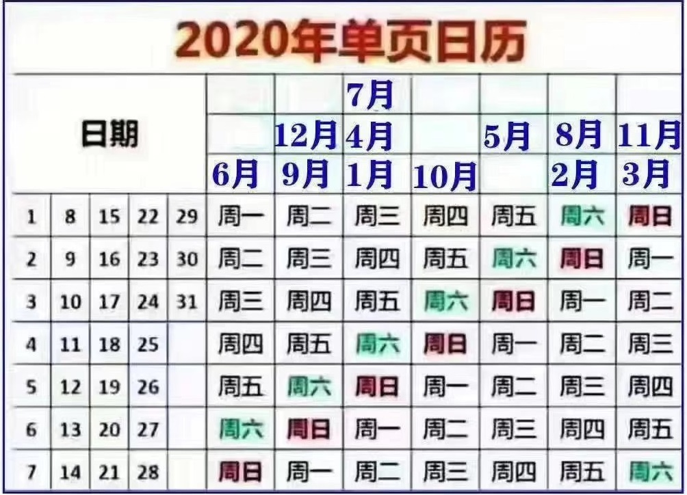

# 2020

## Introduction

The 2020 weekly CEU scientific meetings will be on Thursdays 10-11am (or occasionally 12-1pm). Each meeting will involve one scientific presentation and discussion. Generally, we suggest a 20-minute power-point style presentation focusing on “work in progress”.  We hope these meetings will provide opportunities 

1. to disseminate our research to the CEU, 
2. to gain scientific feedback on projects and 
3. for generic presentation skills training. 

If you have a conference presentation coming up, you may wish to practice it in one of these meetings. 

We hope that over 2020, each member of the CEU will have an opportunity to give a presentation. We plan to rotate the focus of the meetings between general themes of “Epidemiology”, “Genomics” and “Biostatistics” and hope you will be willing to regularly participate in at least one of these themes. 

The schedule and slides from presentations can be found in the shared folder: W:\Administration\CEU meetings. Here is a [lunar calendar](https://hjdev.github.io/vue-lunar-fullcalendar/#/vue-lunar-fullCalendar).

## Conferences

* [AHA 2020](https://www.pr-medicalevents.com/congress/aha-2020/).
* [ASHG 2020](https://www.ashg.org/2020meeting/).
* [EMGM 2020](https://wp.unil.ch/emgm2020/).
* [ESHG 2020](https://2020.eshg.org/).
* [IGES 2020](https://iges.memberclicks.net/iges-2020).
* [ICQG6 2020](https://icqg6.org/).
* [JSM 2020](https://www.amstat.org/ASA/Meetings/Joint-Statistical-Meetings.aspx).
* [RSS 2020](https://www.statslife.org.uk/news/3999-bournemouth-chosen-to-host-rss-2020-conference).
* [useR! 2020](https://user2020.r-project.org/).
* [Wellcome Genome Campus Advanced Courses and Scientific Conferences 2020](https://coursesandconferences.wellcomegenomecampus.org/).

