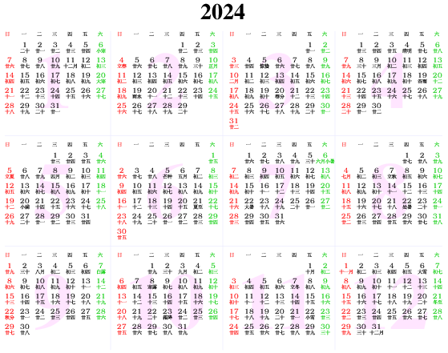

# 2024

### [A glance](https://www.calendarpedia.co.uk/download/calendar-2024-landscape-year-at-a-glance-in-colour.pdf)

## Calendrical links

- Chinese Calendar Online: [2024 Chinese Calendar](https://www.chinesecalendaronline.com/2024/), [24 Solar terms](https://www.chinesecalendaronline.com/solar-terms/), [Auspicious direction](https://www.chinesecalendaronline.com/), [Zodiac](https://www.chinesecalendaronline.com/zodiac/)
- Other sites on 24 Solar terms: [China Education Tours](https://www.chinaeducationaltours.com/guide/culture-24-solar-terms.htm). [China Highlights](https://www.chinahighlights.com/festivals/the-24-solar-terms.htm)

## Events

- Fastival of Genomics & Biodata, 24-25 January 2024, ExCeL, London, Web: <https://tinyurl.com/43tyteb8> (Agenda, <https://tinyurl.com/3y52zcns>)
- ESHG, 1-4 June, Berlin, Germany (deadline for abstract submission, *Thursday, 1 February, 2024, 23.59 hrs*) <https://2024.eshg.org/>
- EMGM, 3-4 April, Klosterneuburg, Austria (deadline for abstract submission, 15 March 2024), Web: <https://emgm2024.ista.ac.at/>
- RSS, 2-5 September, Brighton, UK, Web: <https://rss.org.uk/training-events/events/events-2024/rss-2024-international-conference-(1)/>.
- [Cambridge Proteomics and Mass Spectrometry Meeting](https://www.eventbrite.com/e/cambridge-proteomics-and-mass-spectrometry-meeting-tickets-980322359567), Thu, 17 Oct 2024 12:00 - 17:30 BST, Babraham Research Campus, <https://www.babraham.com/> ([map](https://maps.app.goo.gl/dBWY5irDpTyKB2vq5)), Sponsors:
    - Thermo Fisher Scientific, <https://www.thermofisher.com/uk/en/home.html>
    - Evosep, <https://www.evosep.com/>
    - MS WiL, <https://www.mswil.com/>
    - ATG Scientific, <https://atgscientific.co.uk/>
    - British Society for Proteome Research (BSPR), <https://www.bspr.org/>
    - Babraham Institute, <https://www.babraham.ac.uk/>
    - Babraham Research Campus, <https://www.babraham.com/>

## Funding calls

- [Accelerate-C2D3 Funding Call](https://acceleratescience.github.io/news/2024-05-20-accelerate-c2d3-funding-call-for-novel-applications-of-ai-for-research-and-innovation-2024.html)
