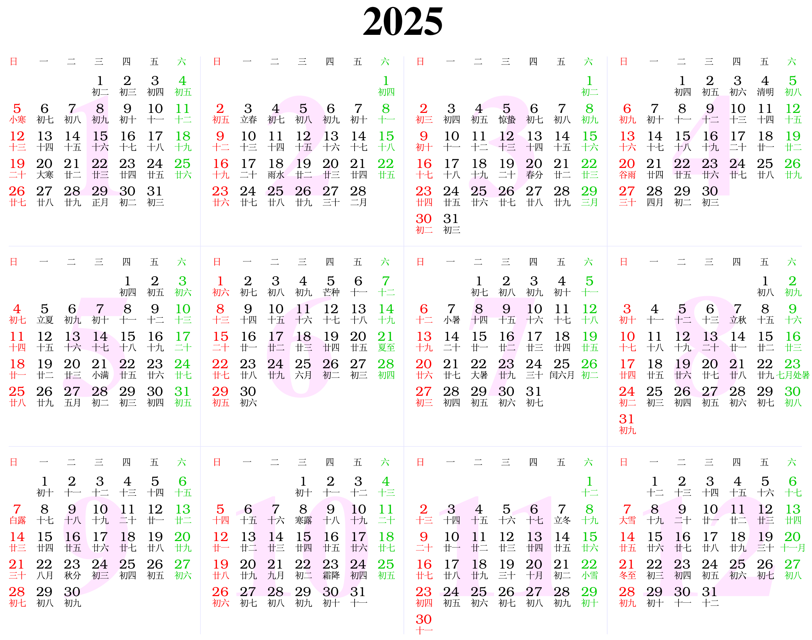

# 2025

### [A glance](https://www.calendarpedia.co.uk/download/calendar-2025-landscape-year-at-a-glance-in-colour.pdf)

## Local events

- Olink Lunch & Learn session
    - Title: Running an Olink Project, from Planning to Analysis
    - Date: Friday, 31st January 2025
    - Time: 12:00-13:00
    - Location: Seminar Room 4, The School of Clinical Medicine Cambridge Biomedical Campus, CB2 0SP
    - Registration link, <https://info.olink.com/cambridge-lunch-learn-1>
- SEGEG, Cancer Theme
    - Tuesday 18th March (2pm-5pm)
    - Chester Beatty Laboratories, 237 Fulham Rd, London SW3 6JB (5 mins walk from South Kensington Tube station).
    - Contact Zeid Kuzbari, <zeid.kuzbari@icr.ac.uk>, if you wish to present.
    - Contact Clare Turnbull lab, <turnbull.lab@icr.ac.uk>, including your name and organisation if you plan to attend.
- CambridgeProtMS, <CambridgeProtMS@gmail.com> (Also see the initial post, [2024](https://cambridge-ceu.github.io/CEU-matters/2024/#events))
    - Thursday 3rd April (~12-5pm), Babraham Research Campus
    - Thursday 18th September (~12-5pm), the DISC, AstraZeneca building, Addenbrookes

## Conferences

- The Festival of Genomics & Biodata, 29-30 January 2025, ExCeL, London, <https://festivalofgenomics.com/london/en/page/2025-homepage>
- European Mathematical Genetics Meeting (EMGM) 2025, 8th-9th April, Brest, France, <https://emgm2025.sciencesconf.org/>.
- The 2025 American Causal Inference Conference organized by the Society for Causal Inference, Detroit, Michigan, May 13-16, <https://sci-info.org/annual-meeting/>.
- European Human Genetics Conference, May 24–27, Milan, Italy, <https://2025.eshg.org/>.
- The annual international conference on Intelligent Systems for Molecular Biology (ISMB), July 20-24, in Liverpool, United Kingdom, <https://www.iscb.org/ismbeccb2025/home>.
- The American Society of Human Genetics (ASHG) meeting, October 14-18, Boston, USA, <https://www.ashg.org/meetings/2025meeting/>.
- International Conference on Cardiology and Cardio Care, 28-29 November 2025, Millennium Hotel Paris Charles De Gaulle, Paris, France. Web: <https://www.ctsnet.org/events/international-conference-cardiology-and-cardio-care>, Email: <cardiocare@scientexconferences.org>.

### [Fudan Medical College calender](https://mp.weixin.qq.com/s/r-2OoPMpHTDtzRhUdFsy5g)

