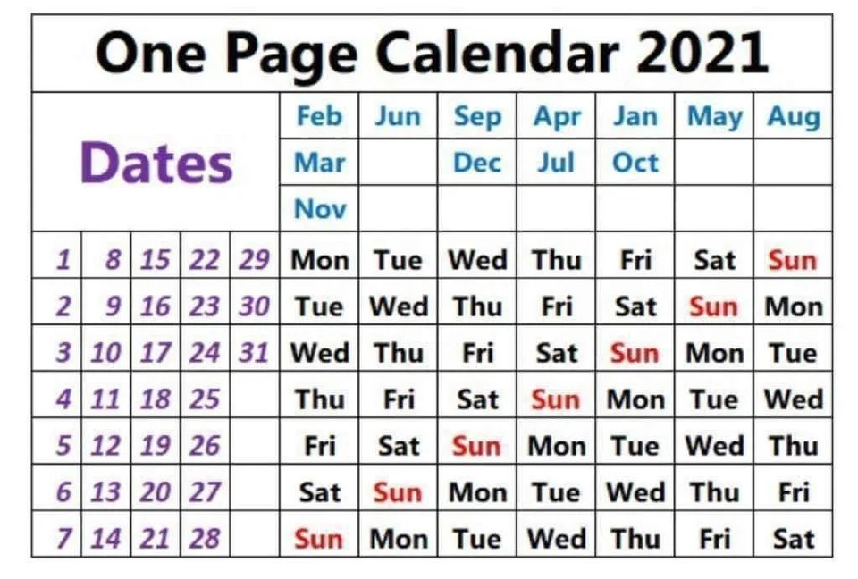

The repository highlights information on seminars and presentations, etc., at the Cardiovascular Epidemiology Unit (CEU), as notified via <a href="mailto:phpc-ceu-group@medschl.cam.ac.uk">the mailing list</a> as noted in [phpc-ceu-group.md](phpc-ceu-group.md).

---

* [Health Data Research (HDR) UK](https://cambridge-ceu.github.io/CEU-scientific-meetings/#health-data-research-hdr-uk)
* [Schedules](https://cambridge-ceu.github.io/CEU-scientific-meetings/#schedules)
* [The COVID-19 pandemic](https://cambridge-ceu.github.io/CEU-scientific-meetings/#the-covid-19-pandemic)
* [Zoom video communications](https://cambridge-ceu.github.io/CEU-scientific-meetings/#zoom-video-communications)
* [Online facilities](https://cambridge-ceu.github.io/CEU-scientific-meetings/#online-facilities)
* [Mailing lists, slack channels and video conferencing](https://cambridge-ceu.github.io/CEU-scientific-meetings/#mailing-lists-events-slack-channels-and-video-conferencing)
* [External talks](https://cambridge-ceu.github.io/CEU-scientific-meetings/#external-talks)
* [2021 conferences](https://cambridge-ceu.github.io/CEU-scientific-meetings/#2021-conferences)

---

Look forward to 2021, the following topics will be welcome.

* Work in progress
* New ideas, projects, and datasets
* Seminars about exciting papers, methods, and topics
* Practice presentations for upcoming conferences, seminars, etc
* And other suggestions that you might have!

 (Calendar from https://www.reddit.com/r/coolguides/comments/kkalio/a_cool_2021_one_page_calendar/)

